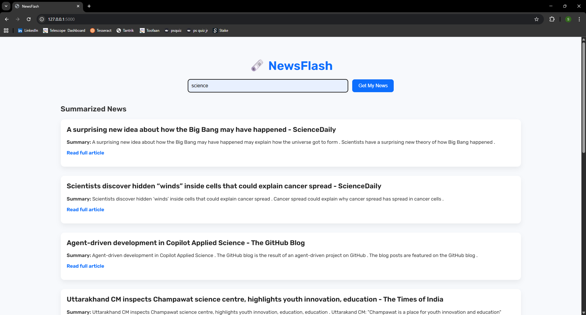

\# 📰 General Newsletter Generator


A Flask-based web application that automatically fetches, filters, and summarizes news articles from across the web — delivering personalized, concise newsletters on topics you care about.


\---


\## 🚀 What It Does


Instead of manually browsing multiple news websites, this app:

\- Lets users \*\*select topics\*\* they're interested in (e.g., Technology, Sports, Business)

\- \*\*Fetches live articles\*\* from RSS feeds across the web

\- \*\*Extracts full article content\*\* using Newspaper3k

\- \*\*Summarizes each article\*\* into 3–4 lines using transformer models (BERT/GPT-2)

\- Delivers a clean, readable \*\*newsletter with article links\*\*


\---


\## 🛠️ Tech Stack


| Layer | Technology |

|-------|-----------|

| Backend | Python, Flask |

| News Fetching | RSS Feeds, Newspaper3k |

| Summarization | Hugging Face Transformers (BERT, GPT-2) |

| Frontend | HTML, CSS |

| Filtering | Custom keyword-based filter (filter.py) |


\---


\## 📁 Project Structure


```

General-Newsletter-Generator/

│

├── app.py              # Main Flask app — routes and app logic

├── news\_scraper.py     # Fetches articles from RSS feeds

├── filter.py           # Filters articles by user-selected topics

├── summarizer.py       # Summarizes articles using transformer models

├── index.html          # Frontend UI for topic selection

├── requirements.txt    # All dependencies

```


\---


\## ⚙️ How It Works


```

User selects topics

&#x20;       ↓

RSS feeds fetched (news\_scraper.py)

&#x20;       ↓

Articles filtered by topic (filter.py)

&#x20;       ↓

Content extracted via Newspaper3k

&#x20;       ↓

Summarized using BERT/GPT-2 (summarizer.py)

&#x20;       ↓

Newsletter displayed with links (index.html)

```


\---


\## 🔧 Installation \& Setup


1\. \*\*Clone the repository\*\*

```bash

git clone https://github.com/Sri-Lohith-Mulugu/General-Newsletter-Generator.git

cd General-Newsletter-Generator

```


2\. \*\*Install dependencies\*\*

```bash

pip install -r requirements.txt

```


3\. \*\*Run the app\*\*

```bash

python app.py

```


4\. \*\*Open in browser\*\*

```

http://localhost:5000

```


\---


\## 📌 Key Features

## 📸 Screenshot



\- 🔍 \*\*Topic-based filtering\*\* — get only the news you want

\- ⚡ \*\*Automatic summarization\*\* — no need to read full articles

\- 🔗 \*\*Source links included\*\* — verify and read more if needed

\- 🧠 \*\*NLP-powered\*\* — uses state-of-the-art transformer models


\---


\## 🧠 What I Learned


\- How NLP pipelines work end-to-end (fetch → extract → summarize)

\- Using pre-trained transformer models (BERT, GPT-2) via Hugging Face

\- Building and routing a Flask web application

\- RSS feed parsing and web content extraction with Newspaper3k


\---


\## 👥 Team


Developed as a group academic project.


\---


\## 📄 License


This project is for educational purposes.


